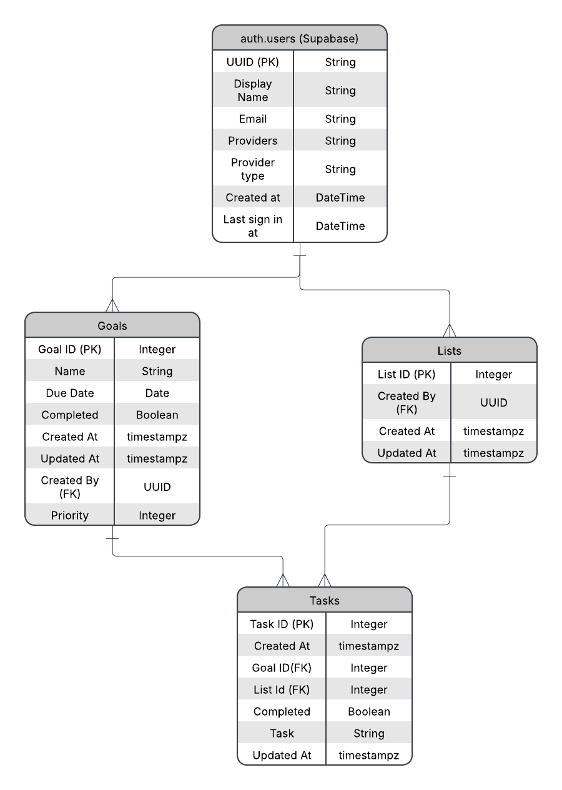

# FirstStep

An AI-powered goal achievement platform that breaks down ambitious goals into actionable daily to-do lists. Tell FirstStep what you want to accomplish, and it generates a structured plan — then surfaces the right tasks each day so you always know what to work on next.

Built with Next.js, Supabase, and the Gemini API via LangChain.

---

## Why FirstStep?

Most to-do apps ask you to manage your own task lists. FirstStep flips that — you define the destination, and AI figures out the steps. Each morning you get a focused daily plan derived from your active goals, adjusted to your pace and priorities.

---

## Tech Stack

| Layer     | Technology                  |
| --------- | --------------------------- |
| Framework | Next.js (App Router)        |
| Styling   | Tailwind CSS                |
| Database  | Supabase (PostgreSQL)       |
| Auth      | Supabase Auth               |
| AI        | Google Gemini via LangChain |

---

## Entity-Relationship Diagram



---

## Getting Started

### Prerequisites

- Node.js 18+
- A Supabase project (free tier works)
- A Google Gemini API key

### Setup

```bash
git clone https://github.com/yourusername/first-step.git
cd first-step
npm install
```

Create a `.env.local` file:

```env
NEXT_PUBLIC_SUPABASE_URL=your_supabase_url
NEXT_PUBLIC_SUPABASE_ANON_KEY=your_anon_key
GOOGLE_API_KEY=your_gemini_api_key
```

Run the development server:

```bash
npm run dev
```

Open [http://localhost:3000](http://localhost:3000).

---

## License

MIT